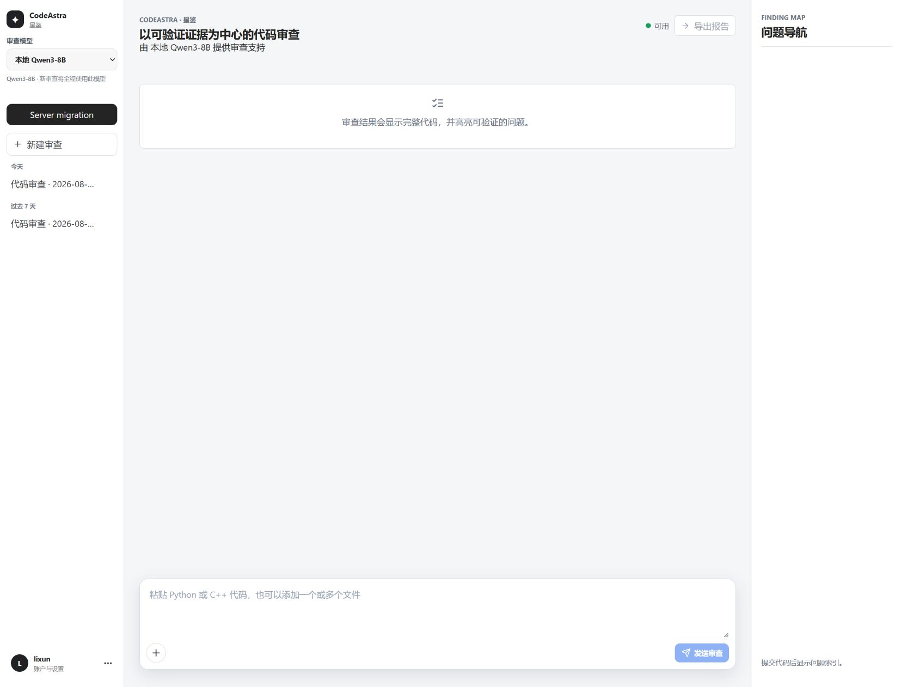
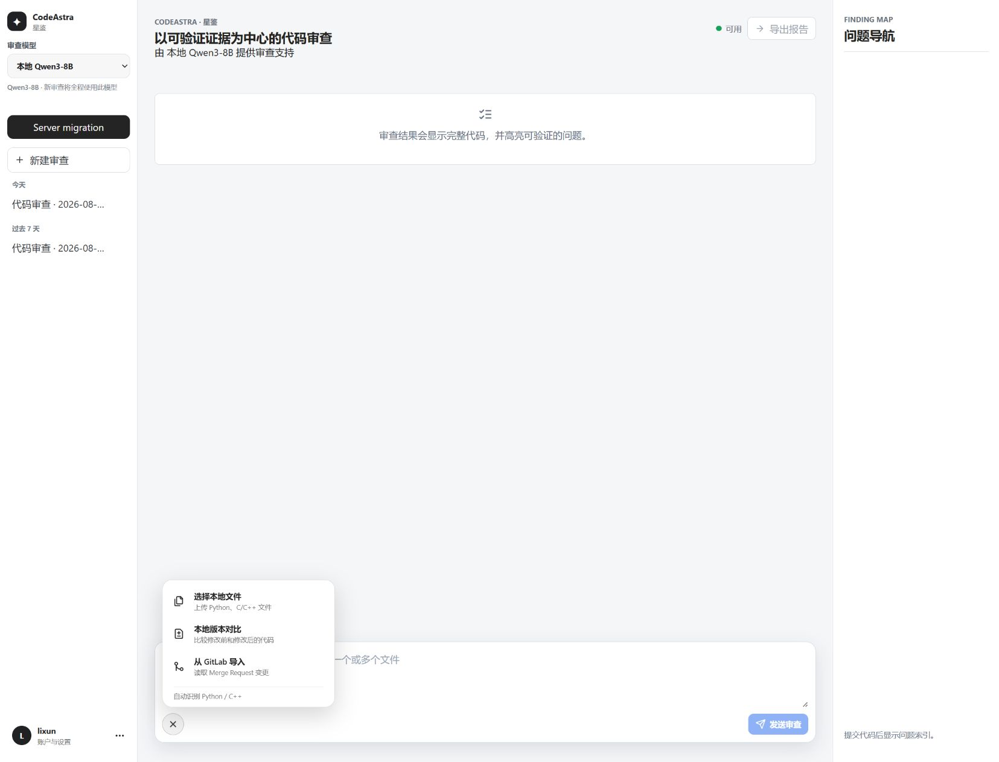
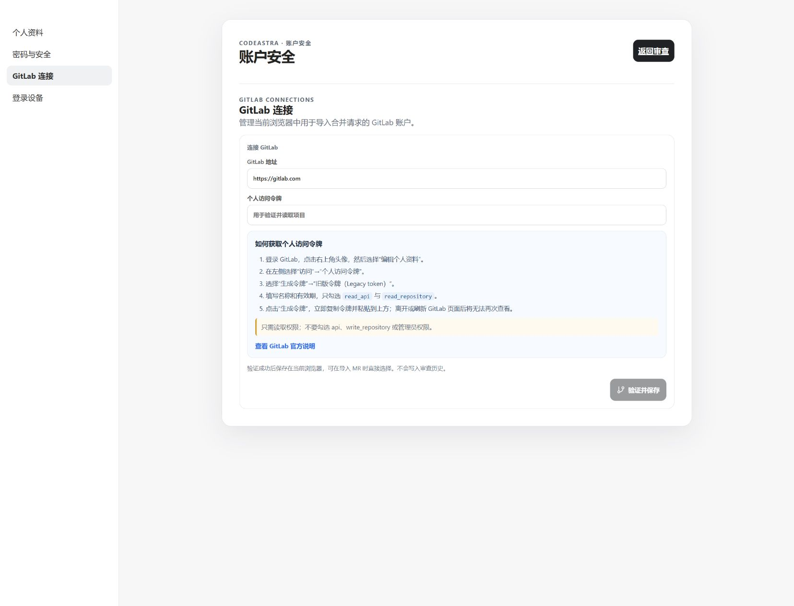
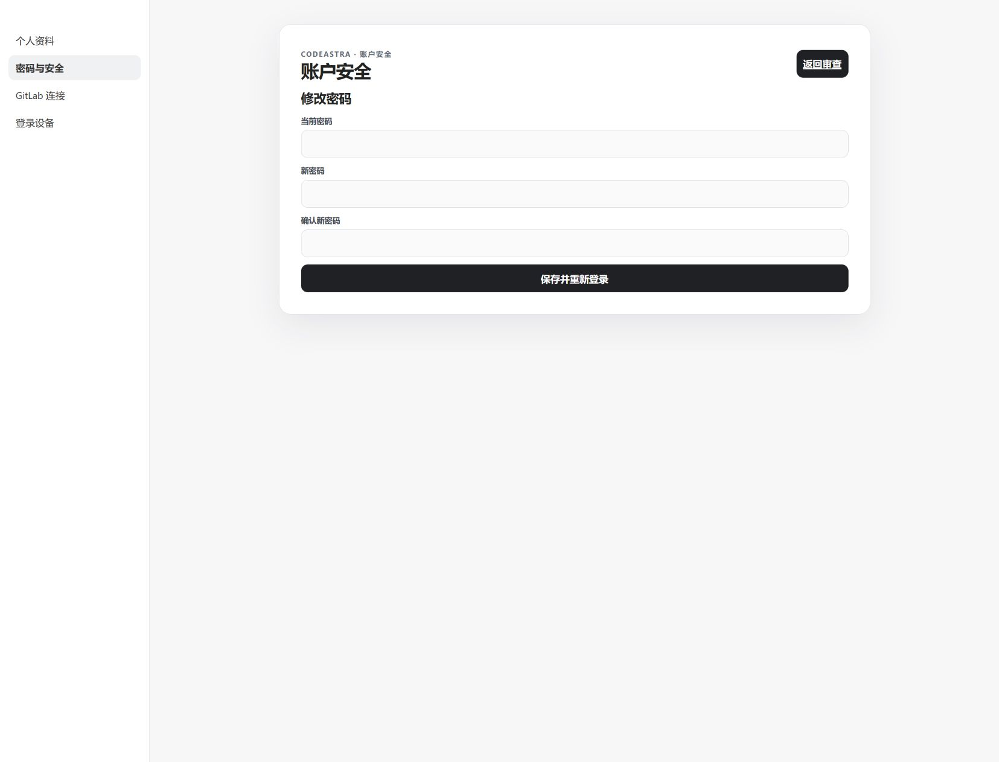

# CodeAstra（星鉴）

CodeAstra 是一个面向真实研发流程的多用户智能代码审查与辅助修复平台。它将静态分析、本地 Qwen/SGLang 模型和 DeepSeek API 组合为证据驱动的审查流水线，让每个问题都能关联到文件、代码范围、风险、证据、验证状态与可执行修复，而不只是返回一段模型文本。

> 没有本地模型也可以使用：将服务设置为 **DeepSeek-only**，在页面中选择 **DeepSeek API** 并填写自己的 API Key，即可使用完整的代码导入、审查、修复、追问和历史管理流程，无需部署 Qwen、SGLang 或 PPU/GPU 环境。

## 界面预览

### 使用流程


### 主工作区



### 添加代码与项目



### GitLab 连接



### 账户安全



完整界面图片还包括[登录页面](docs/images/codeastra-user-guide/01-login.png)、[账户菜单](docs/images/codeastra-user-guide/05-account-menu.png)和[登录设备管理](docs/images/codeastra-user-guide/09-login-devices.png)。

## 完整功能

### 多来源代码审查

- 支持粘贴代码、单文件和多文件项目审查。
- 支持本地差异与版本变更导入。
- 支持 GitLab 项目、分支、提交和合并请求相关流程。
- 使用 SSE 持续返回审查进度、阶段状态与结果。
- 支持审查取消、恢复、重命名、删除和历史记录管理。

### 证据驱动的分析流水线

- 使用 Ruff、Pyflakes、LibCST、AST 和 Tree-sitter 执行确定性分析与结构解析。
- 结合静态结果、依赖关系、仓库图、上下文预算和模型语义分析。
- 对发现项执行证据校验、重复项合并、风险评分和适用性判断。
- 区分已验证问题、需要人工判断的问题和不可用的分析覆盖，避免把模型推测伪装成事实。
- 提供审查管线健康状态、分析器能力和运行指标接口。

### 安全的代码修复闭环

- 针对具体问题生成修复预览，不直接覆盖原始代码。
- 对未定义名称等问题分析作用域、可见参数、局部变量、导入和跨文件导出。
- 在意图不唯一时要求用户选择修复方向，避免猜测业务含义。
- 支持确认或放弃修复候选，并记录修订历史。
- 支持撤销修订、查看修复后文件、下载统一补丁和修复文件 ZIP。

### 上下文追问与复核

- 追问可绑定审查、文件、问题或代码选区。
- 历史上下文按用户、审查和问题范围隔离，避免跨任务串联。
- 支持围绕审查结果继续解释、复核或生成新的修复预览。

### 多模型与部署能力

- 支持本地 Qwen3/SGLang OpenAI 兼容端点和 DeepSeek API。
- 本地模型不是必需依赖；可使用 `deepseek_only` 模式只连接 DeepSeek。
- 通过模型 profile 固定审查所使用的模型与路由，保持结果可解释。
- 支持模型实例健康检查、故障分类、路由与容量状态展示。
- 提供部署状态、环境探测、模型发现、部署计划和应用接口。
- 支持前后端一体化服务，也可按远程前端、本地网关和独立模型服务拆分部署。

### 多用户与安全控制

- 提供登录、退出、全部会话退出、密码修改和登录设备管理。
- 审查、文件、事件、追问、修订和密钥配置均按用户隔离。
- 管理员可创建、启用、禁用、批量管理、重置密码和删除用户。
- 服务端执行 owner 校验、CSRF 防护、请求体限制、登录限流和会话失效控制。
- GitLab Token、DeepSeek Key、SSH Key、模型权重和生产数据库不进入源码仓库。

### Web 工作台

- React 单页工作区统一展示代码、问题、证据、历史、修复和追问。
- 支持代码查看、统一差异、问题定位、修复预览和修订历史。
- 提供账户安全、管理员用户管理、GitLab 连接和模型设置界面。
- 针对登录过期、模型故障、导入错误和修复冲突提供明确状态反馈。

## 技术架构

- 后端：Python 3.12、FastAPI、Pydantic、SQLite、Uvicorn。
- 前端：React 19、TypeScript、Vite、Vitest。
- 代码分析：Ruff、Pyflakes、LibCST、Tree-sitter、Python AST。
- 模型接入：SGLang/OpenAI 兼容接口、Qwen3、DeepSeek API。
- 分层结构：`domain`、`application`、`infrastructure`、`integrations`、`api` 和 `frontend`。

更详细的设计边界见 [架构说明](docs/ARCHITECTURE.md)，部署资料见 [运维文档](docs/operations/README.md)。

## 没有本地模型：仅使用 DeepSeek

如果电脑或服务器没有 Qwen 权重、SGLang、PPU/GPU，CodeAstra 仍可正常运行。此模式保留静态分析、多文件审查、证据校验、安全修复、结果导出、上下文追问、GitLab 集成和多用户管理，仅把模型推理交给 DeepSeek API。

### 1. 设置 DeepSeek-only 模式

启动后端前设置部署模式：

Linux/macOS：

```bash
export CODE_REVIEW_DEPLOYMENT_MODE=deepseek_only
uvicorn code_review.api.main:app --app-dir src --host 127.0.0.1 --port 8081
```

Windows PowerShell：

```powershell
$env:CODE_REVIEW_DEPLOYMENT_MODE = "deepseek_only"
uvicorn code_review.api.main:app --app-dir src --host 127.0.0.1 --port 8081
```

Windows 默认采用 DeepSeek-only；显式设置该变量可以让不同环境的行为保持一致。此模式会启用 `deepseek-api` profile，并禁用本地 Qwen 端点。

### 2. 在页面中配置 DeepSeek

1. 登录 CodeAstra。
2. 在模型选择器中选择 **DeepSeek API**。
3. 输入自己的 DeepSeek API Key。
4. 点击 **验证并加载模型**。
5. 使用自动选择，或手动选择账号当前可用的 DeepSeek 模型。
6. 添加代码并开始审查。

API Key 保存在当前浏览器的本地存储中，并按 CodeAstra 用户账号隔离；发起 DeepSeek 请求时由页面传给后端。不要把真实 Key 写入 README、源码、`.env` 示例或提交记录。浏览器存储并不等同于系统级密钥保险库，请只在可信设备和 HTTPS 页面上使用，并在共享设备使用后清除 Key。

### 3. 使用边界

- 不需要：本地模型权重、SGLang、PPU/GPU、CUDA 或本地模型端口。
- 仍需要：可访问 DeepSeek API 的网络、有效 API Key、可用权限和账户余额。
- DeepSeek 不可达、Key 无效、请求限流或余额不足时，模型审查会失败；静态分析能力本身不因此变成本地模型推理。
- 每次审查创建后会固定使用选定的模型，避免执行过程中切换模型造成结果不可解释。

## 本地开发

后端要求 Python 3.12：

```bash
python -m venv .venv
source .venv/bin/activate
pip install -e ".[dev]"
uvicorn code_review.api.main:app --app-dir src --host 127.0.0.1 --port 8081
```

Windows PowerShell 激活虚拟环境时使用 `.venv\Scripts\Activate.ps1`。

前端开发：

```bash
cd frontend
npm install
npm run dev
```

## 验证

```bash
pytest
ruff check src tests
mypy src/code_review

cd frontend
npm test
npm run build
```

涉及真实 PPU、SGLang 或外部 API 的测试需要目标服务与对应配置；离线测试通过不等同于生产模型链路健康。

## 部署说明

仓库只保存应用源码和测试，不包含生产 `.env`、数据库、日志、访问密钥或模型权重。生产部署应通过环境变量或独立清单注入模型端点，并配置 HTTPS、访问控制、备份、日志脱敏和明确的网络边界。
